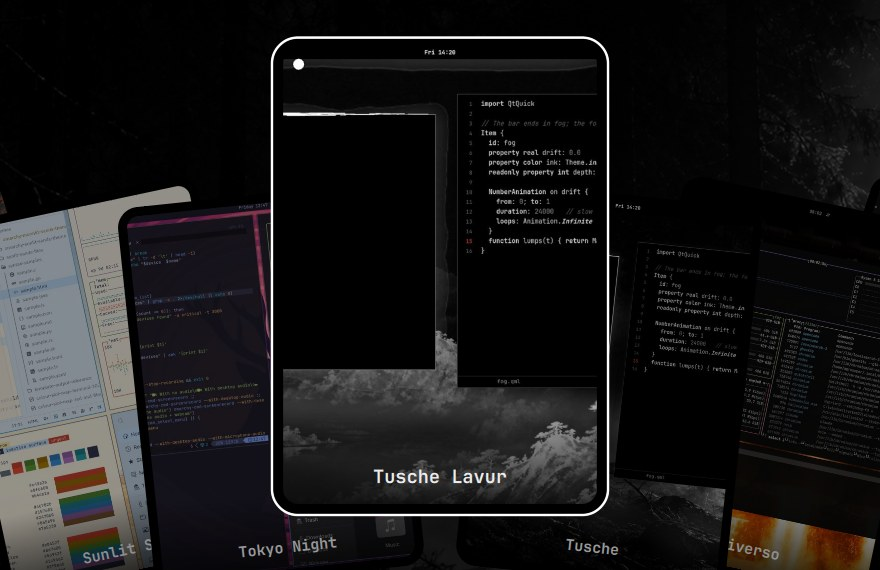

# Card Picker for Omarchy

Theme and wallpaper switcher as a fanned hand of cards. The cards are dealt out
of the centre, fan out a few degrees each, and the chosen one rises and grows.
The layout follows the "Hearthstone" picker of
[Shibumi Shell](https://github.com/HANCORE-linux/Shibumi-Shell) (HANCORE, MIT);
everything else is Omarchy's own:

- lists and previews: `omarchy-theme-switcher --print-rows` and
  `omarchy-menu-images --print-rows` (the current theme's backgrounds and
  `~/.config/omarchy/backgrounds/<theme>`, with Omarchy's video thumbnails)
- switching: `omarchy-theme-set <name>` / `omarchy-theme-bg-set <path>`
- colours, font and Reduced Motion: the running shell's theme tokens



Keys: ← → (h l, wheel) choose · Enter / Space / click apply · type to filter ·
Esc or a click outside closes. The active theme / wallpaper carries a dot.

## Requirements

- **Omarchy:** a recent version with the Quickshell shell (the dev line of early October 2026 or later).
- **Tools:** `git`, `jq`, `rsync` and `python3`.

## Install

It is part of the Tusche look of the [Tusche Bar](https://github.com/nerdislb/omarchy-tusche-bar) (`setup/install.sh`). Alone:

```bash
git clone https://github.com/nerdislb/omarchy-card-picker.git ~/src/omarchy-card-picker
cd ~/src/omarchy-card-picker && ./dev-install.sh
omarchy-shell shell rescanPlugins
omarchy plugin enable nerdibeard.card-picker
bin/menu-override.py enable    # Style → Theme / Background and their keys
```

**Update:** `git pull && ./dev-install.sh`.

**Remove:** `bin/menu-override.py disable && omarchy plugin disable nerdibeard.card-picker`.

`bin/menu-override.py` adds a marked block to Omarchy's user menu extension
(`~/.config/omarchy/extensions/omarchy-menu.jsonc`) that points Style → Theme
and Style → Background at the picker. The keybindings (Super+Shift+Ctrl+Space,
Super+Ctrl+Space) open those entries, so they follow. The block copies the
original label, icon and aliases (Omarchy fills omitted fields with empty
values) and falls back to Omarchy's own pickers when this plugin is not loaded.
`bin/menu-override.py disable` removes only that block.

IPC: `omarchy-shell card-picker open|toggle theme|wallpaper`, `close`, `state`.

## Licence

MIT (`LICENSE`); the fanned layout follows Shibumi Shell's picker (HANCORE, MIT). Theme previews shown in the cards belong to their themes' authors.
